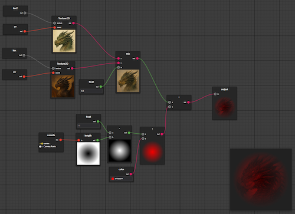

# Viss

A shader editor plugin for VS Code

You can preview online version on https://kaosumaru.github.io/viss/
(online version don't have texture & includes support yet)

## Features

- Creates GLSL code from graph
- Node preview
- Uniforms with default values for preview
- Custom nodes created from GLSL functions

## Planned features

If you have an idea for a feature, don't be afraid to submit it!

- Support for matrices
- Subgraphs
- Optimizations
- Better error handling
- Better readme ;)

## How to use the extension

1. Install extension
2. Create a .viss file and open it
3. Right click to open context menu and add output node
4. Add and connect nodes, right click them to open context menu
5. When you save the graph, the `<file>.viss.glsl` output will be created automatically
