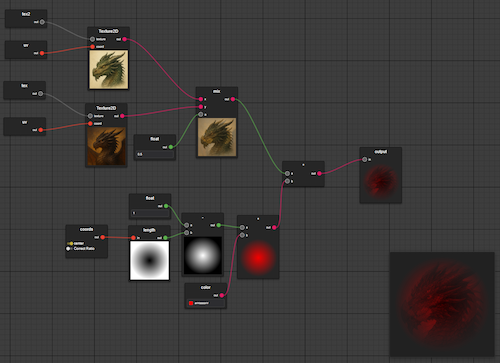

# Viss - Shader Editor Extension for VS Code

A shader editor extension for VS Code

You can preview online version on https://kaosumaru.github.io/viss/
(online version don't have texture & includes support yet)

## How to use the extension

1. Install extension
2. Create a .vis file and open it
3. Right click to open context menu and add output node
4. Add and connect nodes, right click them to open context menu
5. When you save the graph, the `<file>.vis.glsl` output will be created automatically

## Examples

Checkout and open https://github.com/Kaosumaru/viss-examples/tree/master/src/glsl in VSCode